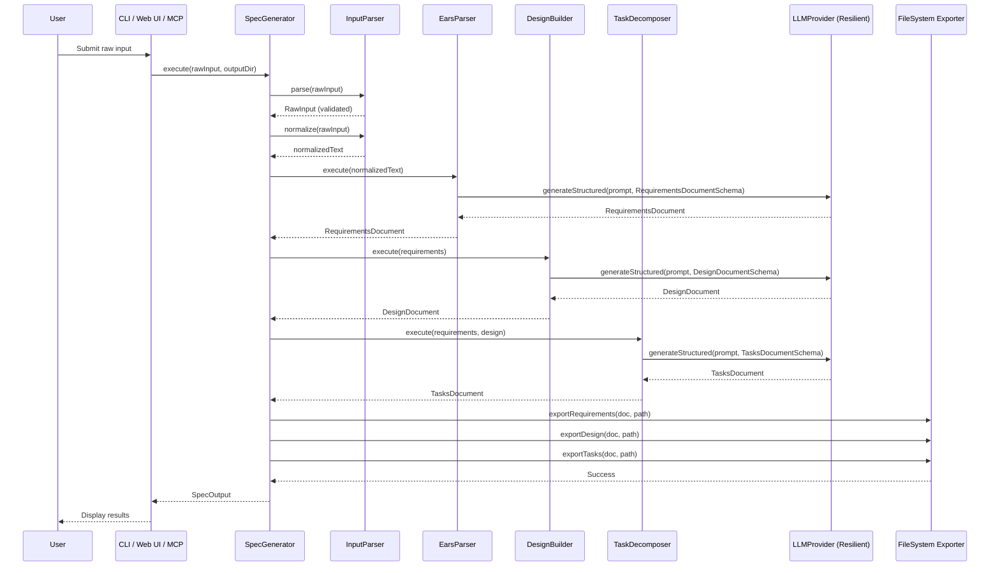
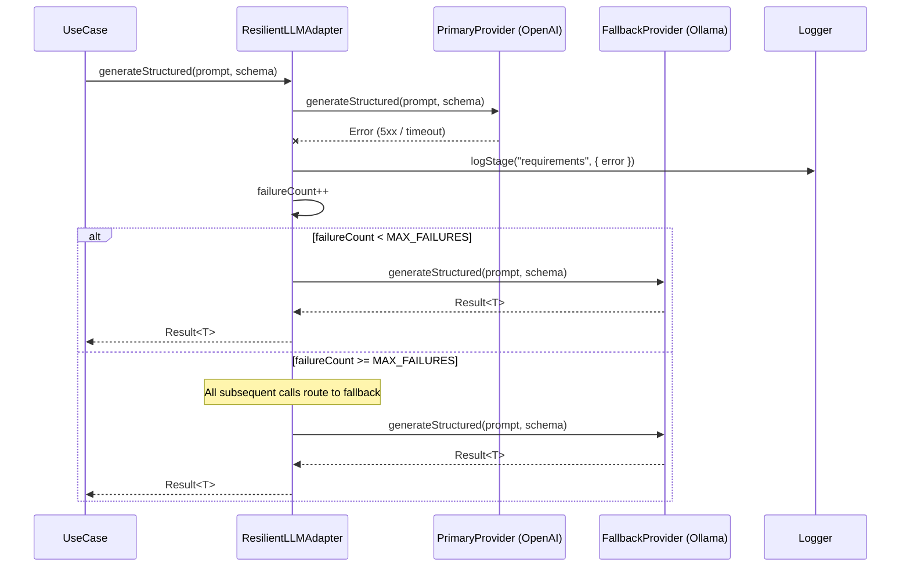
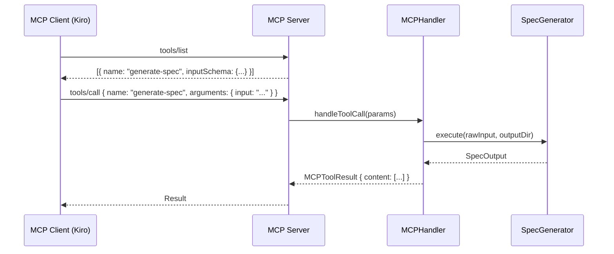
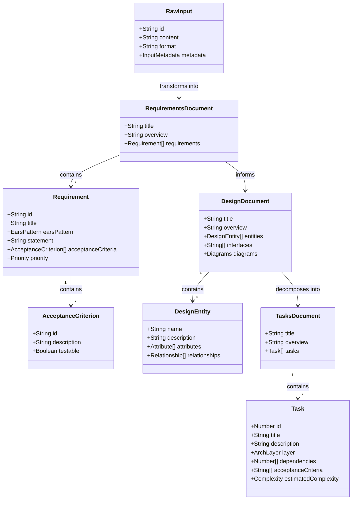

# Design: KiroSpec Builder

## Overview

KiroSpec Builder follows **Clean Architecture** (Hexagonal Architecture) with strict boundary enforcement. Dependencies point inward — infrastructure and adapters depend on use cases, which depend on the domain. No domain entity ever references an external framework or I/O concern.

---

## Architecture Layers

```
┌─────────────────────────────────────────────────────────┐
│                   Infrastructure / Entrypoints           │
│   CLI Engine │ Express/React UI │ MCP Protocol Handler   │
├─────────────────────────────────────────────────────────┤
│                        Adapters                          │
│   OpenAI Provider │ Genkit Provider │ LangChain Provider │
│   Ollama Fallback │ FileSystem Exporter │ HTTP Client    │
├─────────────────────────────────────────────────────────┤
│                       Use Cases                          │
│   SpecGenerator │ EarsParser │ DesignBuilder │           │
│   TaskDecomposer │ MCPHandler                            │
├─────────────────────────────────────────────────────────┤
│                        Domain                            │
│   Entities │ Value Objects │ Interfaces │ Zod Schemas    │
└─────────────────────────────────────────────────────────┘
```

---

## Domain Layer

### Entities

#### RawInput
Represents the unstructured user input before processing.

```typescript
import { z } from "zod";

export const RawInputSchema = z.object({
  id: z.string().uuid(),
  content: z.string().min(1).max(100_000),
  format: z.enum(["text", "markdown", "json", "voice-transcription"]),
  metadata: z.object({
    source: z.string().optional(),
    timestamp: z.string().datetime(),
    language: z.string().default("en"),
  }),
});

export type RawInput = z.infer<typeof RawInputSchema>;
```

#### Requirement
Represents a single EARS-formatted requirement with acceptance criteria.

```typescript
import { z } from "zod";

export const EarsPatternEnum = z.enum([
  "ubiquitous",
  "event-driven",
  "state-driven",
  "optional",
  "unwanted-behavior",
]);

export const AcceptanceCriterionSchema = z.object({
  id: z.string(),
  description: z.string().min(1),
  testable: z.boolean().default(true),
});

export const RequirementSchema = z.object({
  id: z.string().regex(/^FR-\d+\.\d+$/),
  title: z.string().min(1),
  earsPattern: EarsPatternEnum,
  statement: z.string().min(1),
  acceptanceCriteria: z.array(AcceptanceCriterionSchema).min(1),
  priority: z.enum(["must", "should", "could", "wont"]).default("must"),
});

export type Requirement = z.infer<typeof RequirementSchema>;

export const RequirementsDocumentSchema = z.object({
  title: z.string(),
  overview: z.string(),
  requirements: z.array(RequirementSchema).min(1),
  nonFunctional: z.array(RequirementSchema).optional(),
});

export type RequirementsDocument = z.infer<typeof RequirementsDocumentSchema>;
```

#### DesignEntity
Represents a domain entity extracted during design generation.

```typescript
import { z } from "zod";

export const AttributeSchema = z.object({
  name: z.string(),
  type: z.string(),
  required: z.boolean().default(true),
  description: z.string().optional(),
});

export const RelationshipSchema = z.object({
  target: z.string(),
  type: z.enum(["one-to-one", "one-to-many", "many-to-many"]),
  description: z.string().optional(),
});

export const DesignEntitySchema = z.object({
  name: z.string(),
  description: z.string(),
  attributes: z.array(AttributeSchema).min(1),
  relationships: z.array(RelationshipSchema),
});

export const DesignDocumentSchema = z.object({
  title: z.string(),
  overview: z.string(),
  architectureLayers: z.array(z.string()),
  entities: z.array(DesignEntitySchema).min(1),
  interfaces: z.array(z.string()),
  diagrams: z.object({
    sequence: z.string().min(1),
    classDiagram: z.string().min(1),
  }),
});

export type DesignEntity = z.infer<typeof DesignEntitySchema>;
export type DesignDocument = z.infer<typeof DesignDocumentSchema>;
```

#### Task
Represents an atomic implementation task.

```typescript
import { z } from "zod";

export const TaskSchema = z.object({
  id: z.number().int().positive(),
  title: z.string().min(1),
  description: z.string().min(1),
  layer: z.enum(["domain", "use-case", "adapter", "infrastructure"]),
  dependencies: z.array(z.number().int().nonnegative()),
  acceptanceCriteria: z.array(z.string().min(1)).min(1),
  estimatedComplexity: z.enum(["low", "medium", "high"]).default("medium"),
});

export const TasksDocumentSchema = z.object({
  title: z.string(),
  overview: z.string(),
  tasks: z.array(TaskSchema).min(1),
});

export type Task = z.infer<typeof TaskSchema>;
export type TasksDocument = z.infer<typeof TasksDocumentSchema>;
```

---

### Domain Interfaces (Ports)

```typescript
// src/domain/ports/llm-provider.port.ts
import { z } from "zod";

export interface LLMProvider {
  readonly name: string;
  generateStructured<T>(
    prompt: string,
    schema: z.ZodSchema<T>,
    options?: GenerationOptions
  ): Promise<T>;
  isAvailable(): Promise<boolean>;
}

export interface GenerationOptions {
  temperature?: number;
  maxTokens?: number;
  model?: string;
}

// src/domain/ports/spec-exporter.port.ts
export interface SpecExporter {
  exportRequirements(doc: RequirementsDocument, outputPath: string): Promise<void>;
  exportDesign(doc: DesignDocument, outputPath: string): Promise<void>;
  exportTasks(doc: TasksDocument, outputPath: string): Promise<void>;
}

// src/domain/ports/input-parser.port.ts
export interface InputParser {
  parse(raw: unknown): RawInput;
  normalize(input: RawInput): string;
}

// src/domain/ports/pipeline-logger.port.ts
export interface PipelineLogger {
  logStage(stage: PipelineStage, data: StageLogEntry): void;
}

export type PipelineStage =
  | "ingestion"
  | "requirements"
  | "design"
  | "tasks"
  | "export";

export interface StageLogEntry {
  durationMs: number;
  tokensUsed?: number;
  success: boolean;
  error?: string;
}
```

---

## Use Cases Layer

### SpecGenerator (Orchestrator)

The primary use case that orchestrates the full pipeline:

```typescript
// src/use-cases/spec-generator.use-case.ts
export class SpecGeneratorUseCase {
  constructor(
    private readonly inputParser: InputParser,
    private readonly earsParser: EarsParserUseCase,
    private readonly designBuilder: DesignBuilderUseCase,
    private readonly taskDecomposer: TaskDecomposerUseCase,
    private readonly exporter: SpecExporter,
    private readonly logger: PipelineLogger
  ) {}

  async execute(rawInput: unknown, outputDir: string): Promise<SpecOutput> {
    // 1. Parse & validate input
    // 2. Generate requirements (EARS)
    // 3. Generate design document
    // 4. Decompose into tasks
    // 5. Export to .kiro/specs/
    // 6. Return structured result
  }
}
```

### EarsParser

Converts raw feature text into EARS-formatted requirements:

```typescript
// src/use-cases/ears-parser.use-case.ts
export class EarsParserUseCase {
  constructor(private readonly llmProvider: LLMProvider) {}

  async execute(normalizedInput: string): Promise<RequirementsDocument> {
    // Prompt the LLM with EARS pattern templates
    // Validate output against RequirementsDocumentSchema
    // Return structured requirements
  }
}
```

### DesignBuilder

Generates the design document from requirements:

```typescript
// src/use-cases/design-builder.use-case.ts
export class DesignBuilderUseCase {
  constructor(private readonly llmProvider: LLMProvider) {}

  async execute(requirements: RequirementsDocument): Promise<DesignDocument> {
    // Extract domain entities from requirements
    // Generate TypeScript interfaces
    // Generate Mermaid diagrams
    // Validate against DesignDocumentSchema
  }
}
```

### TaskDecomposer

Breaks down the design into atomic implementation tasks:

```typescript
// src/use-cases/task-decomposer.use-case.ts
export class TaskDecomposerUseCase {
  constructor(private readonly llmProvider: LLMProvider) {}

  async execute(
    requirements: RequirementsDocument,
    design: DesignDocument
  ): Promise<TasksDocument> {
    // Analyze requirements + design
    // Generate sequenced, atomic tasks
    // Validate dependency ordering
    // Validate against TasksDocumentSchema
  }
}
```

### MCPHandler

Bridges MCP protocol messages to the spec-generation pipeline:

```typescript
// src/use-cases/mcp-handler.use-case.ts
export class MCPHandlerUseCase {
  constructor(private readonly specGenerator: SpecGeneratorUseCase) {}

  getToolDefinition(): MCPToolDefinition {
    // Return tool schema for `generate-spec`
  }

  async handleToolCall(params: unknown): Promise<MCPToolResult> {
    // Validate params, invoke pipeline, return result
  }
}
```

---

## Adapters Layer

### LLM Provider Adapters

| Adapter | Provider | Use Case |
|---------|----------|----------|
| `OpenAIAdapter` | OpenAI API (GPT-4o) | Primary cloud provider |
| `GenkitAdapter` | Google Genkit | Alternative cloud provider |
| `LangChainAdapter` | LangChain orchestration | Complex chain workflows |
| `OllamaAdapter` | Local Ollama (Llama3, Mistral) | Local fallback / offline use |

```typescript
// src/adapters/llm/openai.adapter.ts
export class OpenAIAdapter implements LLMProvider {
  readonly name = "openai";

  constructor(private readonly config: OpenAIConfig) {}

  async generateStructured<T>(
    prompt: string,
    schema: z.ZodSchema<T>,
    options?: GenerationOptions
  ): Promise<T> {
    // Call OpenAI with JSON mode / structured output
    // Parse response against Zod schema
    // Throw if validation fails
  }

  async isAvailable(): Promise<boolean> {
    // Health check the OpenAI API
  }
}

// src/adapters/llm/ollama.adapter.ts
export class OllamaAdapter implements LLMProvider {
  readonly name = "ollama";

  constructor(private readonly config: OllamaConfig) {}

  async generateStructured<T>(
    prompt: string,
    schema: z.ZodSchema<T>,
    options?: GenerationOptions
  ): Promise<T> {
    // Call local Ollama with JSON format
    // Parse and validate with Zod
  }

  async isAvailable(): Promise<boolean> {
    // Check if Ollama server is running locally
  }
}
```

### Resilient LLM Provider (Decorator)

```typescript
// src/adapters/llm/resilient-llm.adapter.ts
export class ResilientLLMAdapter implements LLMProvider {
  readonly name = "resilient";
  private failureCount = 0;
  private readonly MAX_FAILURES = 3;

  constructor(
    private readonly primary: LLMProvider,
    private readonly fallback: LLMProvider,
    private readonly logger: PipelineLogger
  ) {}

  async generateStructured<T>(
    prompt: string,
    schema: z.ZodSchema<T>,
    options?: GenerationOptions
  ): Promise<T> {
    if (this.failureCount >= this.MAX_FAILURES) {
      return this.fallback.generateStructured(prompt, schema, options);
    }
    try {
      const result = await this.primary.generateStructured(prompt, schema, options);
      this.failureCount = 0;
      return result;
    } catch (error) {
      this.failureCount++;
      this.logger.logStage("requirements", {
        durationMs: 0,
        success: false,
        error: `Primary LLM unavailable, falling back to Ollama`,
      });
      return this.fallback.generateStructured(prompt, schema, options);
    }
  }

  async isAvailable(): Promise<boolean> {
    return (await this.primary.isAvailable()) || (await this.fallback.isAvailable());
  }
}
```

### File System Exporter

```typescript
// src/adapters/exporters/filesystem.exporter.ts
export class FileSystemExporter implements SpecExporter {
  async exportRequirements(doc: RequirementsDocument, outputPath: string): Promise<void> {
    // Render RequirementsDocument → Markdown (EARS format)
    // Write to outputPath/requirements.md
  }

  async exportDesign(doc: DesignDocument, outputPath: string): Promise<void> {
    // Render DesignDocument → Markdown with Mermaid blocks
    // Write to outputPath/design.md
  }

  async exportTasks(doc: TasksDocument, outputPath: string): Promise<void> {
    // Render TasksDocument → Markdown checklist
    // Write to outputPath/tasks.md
  }
}
```

---

## Infrastructure / Entrypoints Layer

### CLI Engine

```typescript
// src/infrastructure/cli/index.ts
// Entry point: `kirospec generate`
// Flags: --input <file|stdin>, --output <dir>, --force, --merge, --provider <name>
// Uses Commander.js or Yargs for argument parsing
// Instantiates DI container and invokes SpecGeneratorUseCase
```

### Express API + React UI

```typescript
// src/infrastructure/web/server.ts
// Express server with:
//   POST /api/generate — accepts raw input, returns generated spec
//   GET /api/health — health check
//   Static serving of React build

// src/infrastructure/web/ui/ (React App)
// Components: InputForm, SpecPreview, ErrorAlert, LoadingSpinner
// State management: React hooks + fetch API
```

### MCP Protocol Handler

```typescript
// src/infrastructure/mcp/server.ts
// Implements Model Context Protocol server
// Registers tool: "generate-spec"
// Supports stdio and HTTP/SSE transports
// Uses @modelcontextprotocol/sdk
```

---

## Dependency Injection

```typescript
// src/infrastructure/di/container.ts
export function createContainer(config: AppConfig): Container {
  const logger = new StructuredLogger();
  const ollama = new OllamaAdapter(config.ollama);
  const primary = resolvePrimaryProvider(config);
  const llm = new ResilientLLMAdapter(primary, ollama, logger);

  const earsParser = new EarsParserUseCase(llm);
  const designBuilder = new DesignBuilderUseCase(llm);
  const taskDecomposer = new TaskDecomposerUseCase(llm);
  const exporter = new FileSystemExporter();
  const inputParser = new ZodInputParser();

  const specGenerator = new SpecGeneratorUseCase(
    inputParser, earsParser, designBuilder, taskDecomposer, exporter, logger
  );

  return { specGenerator, llm, logger };
}
```

---

## Sequence Diagrams

### Full Pipeline: Input to Spec Generation



### LLM Fallback Sequence



### MCP Tool Interaction



---

## Class Diagram: Domain Model



---

## Technology Decisions

| Concern | Choice | Rationale |
|---------|--------|-----------|
| Language | TypeScript (Node.js) | Type safety, Zod integration, ecosystem |
| Schema Validation | Zod | Runtime validation, type inference, LLM output parsing |
| LLM Orchestration | Genkit + LangChain | Structured output, chain composition |
| Local LLM | Ollama | Offline fallback, privacy, no API costs |
| CLI Framework | Commander.js | Lightweight, well-typed, standard |
| Web Framework | Express.js | Minimal, proven, easy MCP integration |
| Frontend | React + Vite | Fast builds, component model, TypeScript support |
| MCP SDK | @modelcontextprotocol/sdk | Official protocol implementation |
| Testing | Vitest | Fast, TypeScript-native, Zod-friendly |
| Containerization | Docker | Reproducible environments, Ollama bundling |
| Logging | Pino | Structured JSON, high performance |

---

## Directory Structure

```
kirospec-builder/
├── src/
│   ├── domain/
│   │   ├── entities/
│   │   │   ├── raw-input.entity.ts
│   │   │   ├── requirement.entity.ts
│   │   │   ├── design-entity.entity.ts
│   │   │   └── task.entity.ts
│   │   ├── ports/
│   │   │   ├── llm-provider.port.ts
│   │   │   ├── spec-exporter.port.ts
│   │   │   ├── input-parser.port.ts
│   │   │   └── pipeline-logger.port.ts
│   │   └── schemas/
│   │       ├── raw-input.schema.ts
│   │       ├── requirement.schema.ts
│   │       ├── design.schema.ts
│   │       └── task.schema.ts
│   ├── use-cases/
│   │   ├── spec-generator.use-case.ts
│   │   ├── ears-parser.use-case.ts
│   │   ├── design-builder.use-case.ts
│   │   ├── task-decomposer.use-case.ts
│   │   └── mcp-handler.use-case.ts
│   ├── adapters/
│   │   ├── llm/
│   │   │   ├── openai.adapter.ts
│   │   │   ├── genkit.adapter.ts
│   │   │   ├── langchain.adapter.ts
│   │   │   ├── ollama.adapter.ts
│   │   │   └── resilient-llm.adapter.ts
│   │   └── exporters/
│   │       └── filesystem.exporter.ts
│   └── infrastructure/
│       ├── cli/
│       │   └── index.ts
│       ├── web/
│       │   ├── server.ts
│       │   └── ui/
│       │       ├── src/
│       │       │   ├── App.tsx
│       │       │   ├── components/
│       │       │   │   ├── InputForm.tsx
│       │       │   │   ├── SpecPreview.tsx
│       │       │   │   └── ErrorAlert.tsx
│       │       │   └── main.tsx
│       │       └── index.html
│       ├── mcp/
│       │   └── server.ts
│       ├── di/
│       │   └── container.ts
│       └── config/
│           └── app.config.ts
├── tests/
│   ├── unit/
│   ├── integration/
│   └── e2e/
├── .kiro/
│   └── specs/
│       ├── requirements.md
│       ├── design.md
│       └── tasks.md
├── package.json
├── tsconfig.json
├── Dockerfile
├── docker-compose.yml
└── README.md
```
