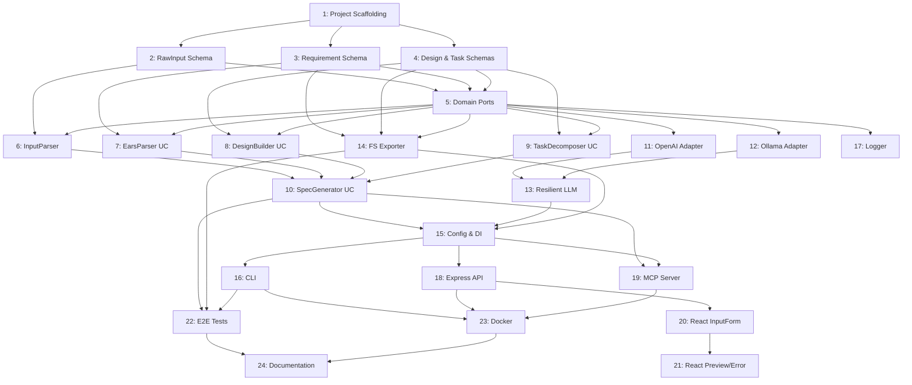

# Tasks: KiroSpec Builder

## Overview

Implementation tasks for KiroSpec Builder, decomposed into atomic, sequential, testable work items. Each task targets a single architectural layer and can be completed in one focused session. Tasks are ordered so that no task depends on a later-numbered task.

---

## Phase 1: Project Foundation & Domain Layer

### Task 1: Project Scaffolding & Configuration

- **Layer:** Infrastructure
- **Dependencies:** None
- **Description:** Initialize the Node.js/TypeScript project with package.json, tsconfig.json, ESLint, Prettier, and Vitest configuration. Set up the directory structure as defined in the design document.
- **Acceptance Criteria:**
  - [ ] `npm init` produces a valid `package.json` with `"type": "module"`.
  - [ ] `tsconfig.json` configured with `strict: true`, `ESNext` module, path aliases for `@domain`, `@use-cases`, `@adapters`, `@infrastructure`.
  - [ ] Vitest config present and `npm test` runs without errors (zero tests passing is acceptable).
  - [ ] Directory structure matches the design document layout (`src/domain/`, `src/use-cases/`, `src/adapters/`, `src/infrastructure/`).
  - [ ] Core dependencies installed: `zod`, `typescript`, `vitest`, `pino`.

---

### Task 2: Domain Schemas — RawInput & Error Types

- **Layer:** Domain
- **Dependencies:** [1]
- **Description:** Implement the `RawInputSchema` and shared error types (`ValidationError`, `PipelineError`, `ErrorResponseSchema`) using Zod. Export TypeScript types inferred from schemas.
- **Acceptance Criteria:**
  - [ ] `src/domain/schemas/raw-input.schema.ts` exports `RawInputSchema` and `RawInput` type.
  - [ ] Schema validates: `id` (UUID), `content` (1–100,000 chars), `format` (enum), `metadata` (nested object).
  - [ ] `src/domain/schemas/error.schema.ts` exports `ErrorResponseSchema` with `code`, `message`, `path`, `details` fields.
  - [ ] Unit tests verify valid input passes and invalid input returns structured Zod errors with correct paths.

---

### Task 3: Domain Schemas — Requirement & AcceptanceCriterion

- **Layer:** Domain
- **Dependencies:** [1]
- **Description:** Implement `RequirementSchema`, `AcceptanceCriterionSchema`, `EarsPatternEnum`, and `RequirementsDocumentSchema` using Zod.
- **Acceptance Criteria:**
  - [ ] `src/domain/schemas/requirement.schema.ts` exports all schemas and inferred types.
  - [ ] `EarsPatternEnum` validates exactly: `ubiquitous`, `event-driven`, `state-driven`, `optional`, `unwanted-behavior`.
  - [ ] `RequirementSchema` enforces `id` regex pattern `FR-\d+\.\d+`.
  - [ ] `RequirementsDocumentSchema` requires at least one requirement entry.
  - [ ] Unit tests cover valid documents and edge cases (empty arrays, invalid IDs, missing fields).

---

### Task 4: Domain Schemas — Design & Task Documents

- **Layer:** Domain
- **Dependencies:** [1]
- **Description:** Implement `DesignEntitySchema`, `DesignDocumentSchema`, `TaskSchema`, and `TasksDocumentSchema` using Zod.
- **Acceptance Criteria:**
  - [ ] `src/domain/schemas/design.schema.ts` exports `DesignEntitySchema`, `DesignDocumentSchema`, and inferred types.
  - [ ] `src/domain/schemas/task.schema.ts` exports `TaskSchema`, `TasksDocumentSchema`, and inferred types.
  - [ ] `TaskSchema.layer` validates exactly: `domain`, `use-case`, `adapter`, `infrastructure`.
  - [ ] Unit tests verify valid documents pass and malformed data returns appropriate errors.

---

### Task 5: Domain Ports (Interfaces)

- **Layer:** Domain
- **Dependencies:** [2, 3, 4]
- **Description:** Define all port interfaces: `LLMProvider`, `SpecExporter`, `InputParser`, `PipelineLogger`. These are pure TypeScript interfaces with no implementation.
- **Acceptance Criteria:**
  - [ ] `src/domain/ports/llm-provider.port.ts` defines `LLMProvider` with `generateStructured<T>()` and `isAvailable()`.
  - [ ] `src/domain/ports/spec-exporter.port.ts` defines `SpecExporter` with methods for each document type.
  - [ ] `src/domain/ports/input-parser.port.ts` defines `InputParser` with `parse()` and `normalize()`.
  - [ ] `src/domain/ports/pipeline-logger.port.ts` defines `PipelineLogger`, `PipelineStage`, and `StageLogEntry`.
  - [ ] All interfaces reference domain schema types (not external libraries).

---

## Phase 2: Use Cases Layer

### Task 6: InputParser Implementation

- **Layer:** Use Case (with Domain validation)
- **Dependencies:** [2, 5]
- **Description:** Implement `ZodInputParser` that validates raw input against `RawInputSchema` and normalizes content (trim, collapse whitespace, normalize line endings).
- **Acceptance Criteria:**
  - [ ] `src/use-cases/input-parser.ts` exports `ZodInputParser` implementing `InputParser`.
  - [ ] `parse()` throws a structured `ValidationError` on invalid input (with field path and expected type).
  - [ ] `normalize()` trims whitespace, collapses multiple spaces, and normalizes `\r\n` to `\n`.
  - [ ] Unit tests cover: valid text, valid markdown, empty input, oversized input, invalid format enum.

---

### Task 7: EarsParser Use Case

- **Layer:** Use Case
- **Dependencies:** [3, 5]
- **Description:** Implement `EarsParserUseCase` that prompts the LLM with EARS templates and validates the structured output against `RequirementsDocumentSchema`.
- **Acceptance Criteria:**
  - [ ] `src/use-cases/ears-parser.use-case.ts` exports `EarsParserUseCase` class.
  - [ ] Constructor accepts `LLMProvider` (dependency injection via port interface).
  - [ ] `execute(normalizedInput)` returns a validated `RequirementsDocument`.
  - [ ] The prompt includes all 5 EARS pattern templates with examples.
  - [ ] Unit tests use a mock `LLMProvider` to verify schema validation and error handling on malformed LLM output.

---

### Task 8: DesignBuilder Use Case

- **Layer:** Use Case
- **Dependencies:** [4, 5]
- **Description:** Implement `DesignBuilderUseCase` that takes requirements and generates a design document with entities, interfaces, and Mermaid diagrams.
- **Acceptance Criteria:**
  - [ ] `src/use-cases/design-builder.use-case.ts` exports `DesignBuilderUseCase` class.
  - [ ] Constructor accepts `LLMProvider`.
  - [ ] `execute(requirements)` returns a validated `DesignDocument`.
  - [ ] Generated output includes at least one sequence diagram and one class diagram in Mermaid syntax.
  - [ ] Unit tests verify output validation and graceful handling of invalid LLM responses.

---

### Task 9: TaskDecomposer Use Case

- **Layer:** Use Case
- **Dependencies:** [4, 5]
- **Description:** Implement `TaskDecomposerUseCase` that takes requirements + design and produces sequenced, atomic tasks with dependency validation.
- **Acceptance Criteria:**
  - [ ] `src/use-cases/task-decomposer.use-case.ts` exports `TaskDecomposerUseCase` class.
  - [ ] Constructor accepts `LLMProvider`.
  - [ ] `execute(requirements, design)` returns a validated `TasksDocument`.
  - [ ] Dependency validation ensures no task references a later-numbered task (topological order).
  - [ ] Each task targets exactly one architectural layer.
  - [ ] Unit tests verify ordering constraints and schema validation.

---

### Task 10: SpecGenerator Orchestrator Use Case

- **Layer:** Use Case
- **Dependencies:** [6, 7, 8, 9]
- **Description:** Implement `SpecGeneratorUseCase` that orchestrates the full pipeline: parse → requirements → design → tasks → export. Includes timing and logging for each stage.
- **Acceptance Criteria:**
  - [ ] `src/use-cases/spec-generator.use-case.ts` exports `SpecGeneratorUseCase` class.
  - [ ] Constructor accepts all dependencies (InputParser, EarsParser, DesignBuilder, TaskDecomposer, SpecExporter, PipelineLogger).
  - [ ] `execute(rawInput, outputDir)` runs all stages sequentially and returns `SpecOutput`.
  - [ ] Each stage emits a log entry with `durationMs` and `success` status.
  - [ ] If any stage fails, the error is captured and a partial result is returned with error details.
  - [ ] Unit tests with mocked dependencies verify the full orchestration flow.

---

## Phase 3: Adapters Layer

### Task 11: OpenAI LLM Adapter

- **Layer:** Adapter
- **Dependencies:** [5]
- **Description:** Implement `OpenAIAdapter` that calls the OpenAI API with structured output (JSON mode) and validates responses against the provided Zod schema.
- **Acceptance Criteria:**
  - [ ] `src/adapters/llm/openai.adapter.ts` exports `OpenAIAdapter` implementing `LLMProvider`.
  - [ ] Uses `openai` npm package with `response_format: { type: "json_object" }`.
  - [ ] `generateStructured<T>()` parses response JSON and validates against the provided Zod schema.
  - [ ] `isAvailable()` performs a lightweight API health check.
  - [ ] Configuration accepts: `apiKey`, `model` (default: `gpt-4o`), `baseUrl` (optional).
  - [ ] Integration test (skippable without API key) verifies a simple structured generation.

---

### Task 12: Ollama LLM Adapter

- **Layer:** Adapter
- **Dependencies:** [5]
- **Description:** Implement `OllamaAdapter` for local LLM inference via the Ollama HTTP API with JSON format output.
- **Acceptance Criteria:**
  - [ ] `src/adapters/llm/ollama.adapter.ts` exports `OllamaAdapter` implementing `LLMProvider`.
  - [ ] Calls Ollama's `/api/generate` endpoint with `format: "json"`.
  - [ ] `generateStructured<T>()` parses and validates JSON response against Zod schema.
  - [ ] `isAvailable()` checks `GET /api/tags` for connectivity.
  - [ ] Configuration accepts: `baseUrl` (default: `http://localhost:11434`), `model` (default: `llama3`).
  - [ ] Unit tests with mocked HTTP verify request formation and response parsing.

---

### Task 13: Resilient LLM Adapter (Decorator)

- **Layer:** Adapter
- **Dependencies:** [11, 12]
- **Description:** Implement `ResilientLLMAdapter` that wraps a primary and fallback provider with automatic failover after 3 consecutive failures.
- **Acceptance Criteria:**
  - [ ] `src/adapters/llm/resilient-llm.adapter.ts` exports `ResilientLLMAdapter` implementing `LLMProvider`.
  - [ ] After 3 consecutive primary failures, all requests route to fallback.
  - [ ] A successful primary call resets the failure counter.
  - [ ] Each fallback activation emits a warning log: `"Primary LLM unavailable, falling back to Ollama"`.
  - [ ] Unit tests verify: normal operation, failover trigger, counter reset, logging.

---

### Task 14: FileSystem Exporter Adapter

- **Layer:** Adapter
- **Dependencies:** [3, 4, 5]
- **Description:** Implement `FileSystemExporter` that renders domain documents into Markdown files and writes them to the output directory.
- **Acceptance Criteria:**
  - [ ] `src/adapters/exporters/filesystem.exporter.ts` exports `FileSystemExporter` implementing `SpecExporter`.
  - [ ] `exportRequirements()` renders EARS-formatted Markdown with acceptance criteria checkboxes.
  - [ ] `exportDesign()` renders Markdown with Mermaid code blocks and TypeScript code fences.
  - [ ] `exportTasks()` renders a numbered task list with checkboxes and metadata.
  - [ ] Creates output directory if it doesn't exist (`mkdir -p` equivalent).
  - [ ] Unit tests verify file creation, correct Markdown formatting, and directory creation.

---

## Phase 4: Infrastructure Layer

### Task 15: Application Configuration & DI Container

- **Layer:** Infrastructure
- **Dependencies:** [10, 13, 14]
- **Description:** Implement `AppConfig` (from env vars / config file) and `createContainer()` function that wires all dependencies together.
- **Acceptance Criteria:**
  - [ ] `src/infrastructure/config/app.config.ts` exports `AppConfig` schema (Zod-validated from `process.env`).
  - [ ] Supports `KIROSPEC_LLM_PROVIDER`, `OPENAI_API_KEY`, `OLLAMA_BASE_URL`, `OLLAMA_MODEL`, `OUTPUT_DIR`.
  - [ ] `src/infrastructure/di/container.ts` exports `createContainer(config)` returning a wired dependency graph.
  - [ ] Missing required env vars produce clear error messages at startup.
  - [ ] Unit tests verify container creation with various config combinations.

---

### Task 16: CLI Entrypoint

- **Layer:** Infrastructure
- **Dependencies:** [15]
- **Description:** Implement the CLI using Commander.js with commands: `generate` (main pipeline), flags for `--input`, `--output`, `--force`, `--merge`, `--provider`.
- **Acceptance Criteria:**
  - [ ] `src/infrastructure/cli/index.ts` exports the CLI program.
  - [ ] `kirospec generate --input <file>` reads file and invokes pipeline.
  - [ ] `kirospec generate` (no input flag) reads from stdin.
  - [ ] `--output <dir>` overrides default output directory (`.kiro/specs/`).
  - [ ] `--force` overwrites existing files without prompt.
  - [ ] `--merge` appends to existing files with incremented IDs.
  - [ ] `--provider <name>` overrides the configured LLM provider.
  - [ ] `--help` displays usage information.
  - [ ] E2E test verifies CLI invocation with a fixture file produces output files.

---

### Task 17: Structured Logger Implementation

- **Layer:** Infrastructure
- **Dependencies:** [5]
- **Description:** Implement `StructuredLogger` using Pino that satisfies the `PipelineLogger` port interface, emitting JSON logs with stage, duration, and token usage.
- **Acceptance Criteria:**
  - [ ] `src/infrastructure/logging/structured-logger.ts` exports `StructuredLogger` implementing `PipelineLogger`.
  - [ ] Uses Pino for JSON-formatted log output.
  - [ ] Each `logStage()` call produces a log entry with: `stage`, `durationMs`, `tokensUsed`, `success`, `error`.
  - [ ] Log level configurable via `LOG_LEVEL` env var (default: `info`).
  - [ ] Unit tests verify log output structure.

---

### Task 18: Express API Server

- **Layer:** Infrastructure
- **Dependencies:** [15]
- **Description:** Implement an Express server with `POST /api/generate` (pipeline trigger) and `GET /api/health` (health check) endpoints.
- **Acceptance Criteria:**
  - [ ] `src/infrastructure/web/server.ts` exports `createServer(container)` function.
  - [ ] `POST /api/generate` accepts JSON body `{ content, format }`, invokes pipeline, returns spec output.
  - [ ] `GET /api/health` returns `{ status: "ok", providers: { primary: bool, fallback: bool } }`.
  - [ ] Request validation uses Zod schemas; invalid requests return 400 with `ErrorResponseSchema` body.
  - [ ] Server port configurable via `PORT` env var (default: `3000`).
  - [ ] Integration tests verify endpoints with supertest.

---

### Task 19: MCP Server Implementation

- **Layer:** Infrastructure
- **Dependencies:** [10, 15]
- **Description:** Implement the MCP protocol server using `@modelcontextprotocol/sdk` that registers the `generate-spec` tool and handles `tools/list` and `tools/call` messages.
- **Acceptance Criteria:**
  - [ ] `src/infrastructure/mcp/server.ts` exports MCP server setup.
  - [ ] Registers tool `generate-spec` with JSON Schema input definition (derived from `RawInputSchema` via `zod-to-json-schema`).
  - [ ] Handles `tools/list` returning the tool definition.
  - [ ] Handles `tools/call` invoking `SpecGeneratorUseCase` and returning results.
  - [ ] Supports `stdio` transport (default) and `HTTP/SSE` transport (via `--transport http` flag).
  - [ ] Unit tests verify tool registration and message handling with mock transport.

---

### Task 20: React Web UI — InputForm Component

- **Layer:** Infrastructure (Frontend)
- **Dependencies:** [18]
- **Description:** Create the React application shell with Vite and implement the `InputForm` component (textarea + submit button).
- **Acceptance Criteria:**
  - [ ] React app scaffolded with Vite + TypeScript in `src/infrastructure/web/ui/`.
  - [ ] `InputForm.tsx` renders a textarea (placeholder: "Paste your feature idea...") and "Generate Spec" button.
  - [ ] Submit triggers a POST to `/api/generate` with the textarea content.
  - [ ] Loading state shows a spinner during API call.
  - [ ] Component is accessible (proper labels, aria attributes).

---

### Task 21: React Web UI — SpecPreview & ErrorAlert Components

- **Layer:** Infrastructure (Frontend)
- **Dependencies:** [20]
- **Description:** Implement `SpecPreview` (Markdown renderer for generated specs) and `ErrorAlert` (dismissible error display) components.
- **Acceptance Criteria:**
  - [ ] `SpecPreview.tsx` renders generated Markdown in three tabs: Requirements, Design, Tasks.
  - [ ] Markdown rendering uses `react-markdown` with syntax highlighting for code blocks.
  - [ ] `ErrorAlert.tsx` displays errors with category, message, and a dismiss button.
  - [ ] Validation errors show field path; LLM errors show retry option; network errors show connectivity warning.
  - [ ] Components render correctly with empty state, loading state, success state, and error state.

---

## Phase 5: Integration & Delivery

### Task 22: End-to-End Pipeline Integration Test

- **Layer:** Integration
- **Dependencies:** [10, 14, 16]
- **Description:** Write E2E tests that invoke the full pipeline with fixture inputs and verify correct output file generation.
- **Acceptance Criteria:**
  - [ ] Test fixture: a 500-word product idea in plain text.
  - [ ] Test invokes `SpecGeneratorUseCase.execute()` with the fixture.
  - [ ] Verifies `requirements.md` contains EARS-formatted requirements with acceptance criteria.
  - [ ] Verifies `design.md` contains Mermaid diagram blocks and TypeScript code fences.
  - [ ] Verifies `tasks.md` contains numbered tasks with dependency ordering.
  - [ ] All output files pass Markdown lint validation.

---

### Task 23: Docker Configuration

- **Layer:** Infrastructure
- **Dependencies:** [16, 18, 19]
- **Description:** Create `Dockerfile` and `docker-compose.yml` for containerized deployment including Ollama sidecar.
- **Acceptance Criteria:**
  - [ ] `Dockerfile` uses multi-stage build: build stage (TypeScript compilation) → production stage (Node.js runtime).
  - [ ] Final image size < 200MB (excluding Ollama).
  - [ ] `docker-compose.yml` defines services: `kirospec` (app), `ollama` (local LLM).
  - [ ] `docker compose up` starts both services with correct networking.
  - [ ] Health check endpoint accessible at `http://localhost:3000/api/health`.
  - [ ] Environment variables are configurable via `.env` file.

---

### Task 24: Documentation & README

- **Layer:** Infrastructure
- **Dependencies:** [22, 23]
- **Description:** Write comprehensive README.md with installation, configuration, usage (CLI, API, MCP, Web UI), and architecture overview.
- **Acceptance Criteria:**
  - [ ] README includes: project description, prerequisites, installation steps, configuration (env vars).
  - [ ] Usage sections for: CLI commands, API endpoints, MCP integration, Web UI.
  - [ ] Architecture diagram (Mermaid) showing layer boundaries.
  - [ ] Contributing guide with development setup instructions.
  - [ ] All code examples in README are syntactically correct and copy-pasteable.

---

## Task Dependency Graph

---

## Summary

| Phase | Tasks | Focus |
|-------|-------|-------|
| 1: Foundation | 1–5 | Project setup, domain schemas, port interfaces |
| 2: Use Cases | 6–10 | Core business logic, pipeline orchestration |
| 3: Adapters | 11–14 | LLM providers, resilience, file export |
| 4: Infrastructure | 15–21 | CLI, API, MCP, Web UI, DI, logging |
| 5: Integration | 22–24 | E2E tests, Docker, documentation |

**Total Tasks:** 24  
**Estimated Complexity:** 8 Low, 10 Medium, 6 High  
**Critical Path:** T1 → T2/T3/T4 → T5 → T7 → T10 → T15 → T16 → T22 → T24
