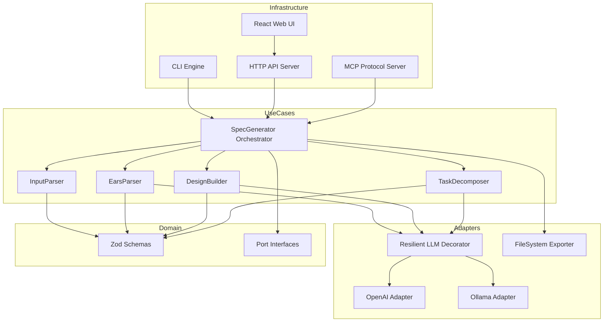

# KiroSpec Builder

**AI-powered specification generation** — Convert unstructured feature ideas into structured Kiro Specification files (`.kiro/specs/`).

KiroSpec Builder is a specialized AI Agent pipeline that ingests raw feature descriptions (voice notes, product ideas, PRDs) and produces:
- **`requirements.md`** — EARS-formatted functional requirements with testable acceptance criteria
- **`design.md`** — Domain entities, TypeScript interfaces, and Mermaid architecture diagrams
- **`tasks.md`** — Atomic, sequenced implementation tasks with dependency ordering

---

## Architecture



**Clean Architecture** with strict dependency inversion — infrastructure depends on use cases, which depend on the domain. No domain entity references external frameworks.

---

## Prerequisites

- **Node.js** ≥ 20.0.0
- **npm** ≥ 9
- One of:
  - **OpenAI API Key** — for cloud LLM
  - **Ollama** — for local LLM inference (no API key needed)
- **Docker** (optional) — for containerized deployment

---

## Installation

```bash
git clone https://github.com/elecodes/KiroSpec-Builder.git
cd KiroSpec-Builder
npm install
npm run build
```

---

## Configuration

Copy `.env.example` to `.env` and set your values:

```bash
cp .env.example .env
```

| Variable | Default | Description |
|----------|---------|-------------|
| `KIROSPEC_LLM_PROVIDER` | `openai` | Primary LLM provider (`openai`, `ollama`) |
| `OPENAI_API_KEY` | — | OpenAI API key (required if provider=openai) |
| `OPENAI_MODEL` | `gpt-4o` | OpenAI model |
| `OLLAMA_BASE_URL` | `http://localhost:11434` | Ollama server URL |
| `OLLAMA_MODEL` | `llama3` | Ollama model |
| `OUTPUT_DIR` | `.kiro/specs` | Output directory for generated specs |
| `PORT` | `3000` | HTTP server port |
| `LOG_LEVEL` | `info` | Log level (`trace`, `debug`, `info`, `warn`, `error`) |

---

## Usage

### CLI

```bash
# From a file
kirospec generate --input feature.md

# From stdin
cat product-idea.txt | kirospec generate

# With options
kirospec generate -i prd.md -o ./specs --provider ollama --force

# Show help
kirospec generate --help
```

**Flags:**

| Flag | Short | Description |
|------|-------|-------------|
| `--input <file>` | `-i` | Input file (reads stdin if omitted) |
| `--output <dir>` | `-o` | Output directory (default: `.kiro/specs`) |
| `--force` | — | Overwrite existing files |
| `--merge` | — | Append to existing files |
| `--provider <name>` | `-p` | Override LLM provider |
| `--help` | `-h` | Show help |
| `--version` | `-v` | Show version |

### HTTP API

Start the server:

```bash
npm run dev -- --serve
# or
node dist/infrastructure/cli/index.js --serve
```

**Endpoints:**

```bash
# Health check
curl http://localhost:3000/api/health

# Generate specs
curl -X POST http://localhost:3000/api/generate \
  -H "Content-Type: application/json" \
  -d '{"content": "Build a feature that...", "format": "text"}'
```

### MCP Integration

KiroSpec Builder exposes itself as an MCP tool for integration with AI assistants:

```json
{
  "mcpServers": {
    "kirospec": {
      "command": "node",
      "args": ["dist/infrastructure/cli/index.js", "--mcp"],
      "env": {
        "KIROSPEC_LLM_PROVIDER": "ollama"
      }
    }
  }
}
```

**Tool:** `generate-spec`

```json
{
  "name": "generate-spec",
  "arguments": {
    "content": "Build a collaborative document editor...",
    "format": "text",
    "outputDir": ".kiro/specs"
  }
}
```

### Web UI

Start the development server:

```bash
npm run dev:ui
```

Open `http://localhost:5173` — paste your feature idea, click **Generate Spec**, and view the results in the tabbed preview.

---

## Docker

### Quick Start

```bash
# Start with Ollama (no API key needed)
docker compose up

# Start with OpenAI
OPENAI_API_KEY=sk-xxx docker compose up
```

### Pull Ollama Model

After starting, pull a model:

```bash
docker exec kirospec-ollama ollama pull llama3
```

### Individual Commands

```bash
# Build
docker build -t kirospec-builder .

# Run standalone (with Ollama running separately)
docker run -p 3000:3000 \
  -e KIROSPEC_LLM_PROVIDER=ollama \
  -e OLLAMA_BASE_URL=http://host.docker.internal:11434 \
  kirospec-builder
```

---

## Development

```bash
# Run tests
npm test

# Type check
npm run typecheck

# Lint
npm run lint

# Format
npm run format

# Run E2E tests
npm test -- tests/e2e/
```

### Project Structure

```
kirospec-builder/
├── src/
│   ├── domain/              # Entities, Zod schemas, port interfaces
│   │   ├── schemas/         # RawInput, Requirement, Design, Task, Error
│   │   └── ports/           # LLMProvider, SpecExporter, InputParser, Logger
│   ├── use-cases/           # Business logic (no framework deps)
│   │   ├── input-parser.ts
│   │   ├── ears-parser.use-case.ts
│   │   ├── design-builder.use-case.ts
│   │   ├── task-decomposer.use-case.ts
│   │   └── spec-generator.use-case.ts
│   ├── adapters/            # External integrations
│   │   ├── llm/             # OpenAI, Ollama, Resilient decorator
│   │   └── exporters/       # FileSystem Markdown exporter
│   └── infrastructure/      # Entry points and framework code
│       ├── cli/             # CLI with arg parsing
│       ├── web/             # HTTP API + React UI
│       ├── mcp/             # MCP protocol server
│       ├── config/          # Zod-validated env config
│       ├── di/              # Dependency injection container
│       └── logging/         # Structured JSON logger
├── tests/
│   ├── unit/                # Unit tests per layer
│   ├── integration/         # Integration tests
│   ├── e2e/                 # End-to-end pipeline tests
│   └── fixtures/            # Test fixture files
├── .kiro/specs/             # KiroSpec Builder's own specifications
├── Dockerfile               # Multi-stage production build
├── docker-compose.yml       # App + Ollama orchestration
└── package.json
```

---

## EARS Syntax Reference

KiroSpec Builder generates requirements using the [EARS (Easy Approach to Requirements Syntax)](https://alistairmavin.com/ears/) methodology:

| Pattern | Template | When to Use |
|---------|----------|-------------|
| **Ubiquitous** | `The system SHALL <action>.` | Always-active behavior |
| **Event-Driven** | `WHEN <trigger>, the system SHALL <action>.` | Triggered by an event |
| **State-Driven** | `WHILE <state>, the system SHALL <action>.` | Active during a condition |
| **Optional** | `WHERE <feature>, the system SHALL <action>.` | Feature-gated behavior |
| **Unwanted Behavior** | `IF <error>, THEN the system SHALL <action>.` | Error handling |

---

## Resilience

The system includes automatic LLM failover:

1. Primary provider is called (e.g., OpenAI)
2. On failure → immediately falls back to Ollama for that request
3. After 3 consecutive primary failures → all requests route to Ollama
4. On next successful primary call → counter resets

This ensures the pipeline works even when cloud APIs are down, as long as Ollama is running locally.

---

## Contributing

1. Fork the repository
2. Create a feature branch: `git checkout -b feat/my-feature`
3. Write code following Clean Architecture boundaries
4. Add unit tests for your layer
5. Run `npm test && npm run typecheck && npm run lint`
6. Commit with conventional commits: `feat:`, `fix:`, `docs:`, `refactor:`
7. Push and open a Pull Request

### Development Guidelines

- **Domain layer**: Pure TypeScript, no imports from adapters/infrastructure
- **Use cases**: Depend only on domain ports (interfaces), never on concrete adapters
- **Adapters**: Implement domain ports, can import external libraries
- **Infrastructure**: Wire everything together, framework-specific code

---

## License

MIT
